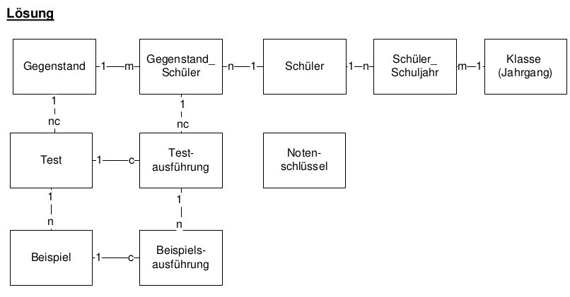

= ADAT 6
Mctom Spdo
1.0.0, {docdate}: INSY
//:toc-placement!:  // prevents the generation of the doc at this position, so it can be printed afterwards
:icons: font
:sectnums:    // Nummerierung der Überschriften / section numbering
:toc: left
:stylesheet: ../../asciidocs/css/dark.css

== Diagramm

== ERD

=== Aufgabe

    Gegenstand(GegenstandID, Name
    Test(TestID, GegenstandID, datum
    Beispiel(BeispielID, TestID, Punkte)
    Beispielsausführung(BeispielsausführungsID, BeispielID, TestausführungsID, Punkte
    Testausführung(TestausführungsID, TestID, Gegenstand_SchülerID
    Gegenstand_Schüler(Gegenstand_SchülerID, GegenstandID, SchülerID
    Schüler(SchülerID, Vorname, Nachname
    Schüler_Schuljahr(Schüler_SchuljarID, SchülerId, KlasseId, Mitarbeit
    Klasse(KlasseId, Name, Schuljahr,
    Notenschlüssel(NotenschlüsselID, note, prozent

=== Lösung

    GEGENSTAND(GStandID, Bezeichnung, ...)
    SCHÜLER(SchülerId, VName, NName, PLZ, ORT, Strasse, GebDat)
    GEGENSTAND_SCHÜLER(GStandID, SchülerID, Schuljahr, Note, DurchschnittProz, Mitarbeit, GesamtProz)
    KLASSE(KlassenID, KlassenBez, Fachrichtung, Maturajahrgang, ...)
    SCHÜLER_SCHULJAHR(SchülerID, KlassenID, Schuljahr, ...)
    TEST(TestID, GStandID, Schuljahr, maxPunkte, ...)
    BEISPIEL(TestID, BeipielID, maxPunkte, ...)
    TESTAUSFÜHRUNG(TestID, GStandID, SchülerID, Schuljahr, erreichtePunkte, GesamtProz, Note)
    BEISPIELAUSFÜHRUNG(TestID, BeispielID, erreichtePunkte)