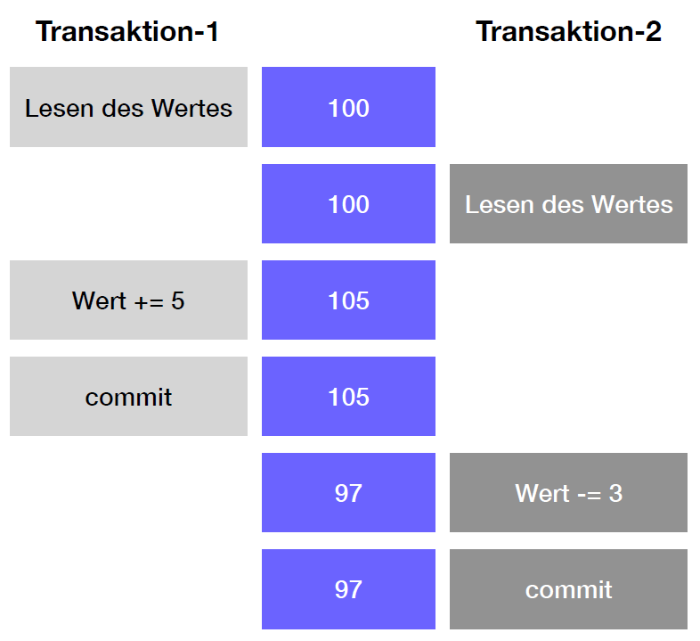
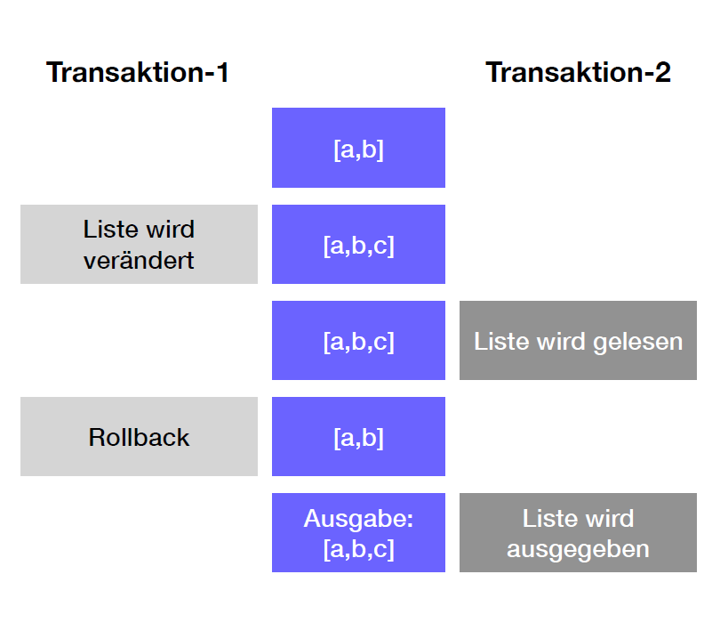
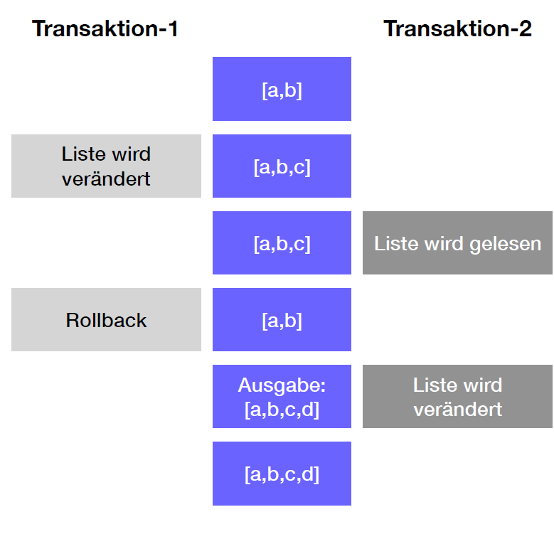
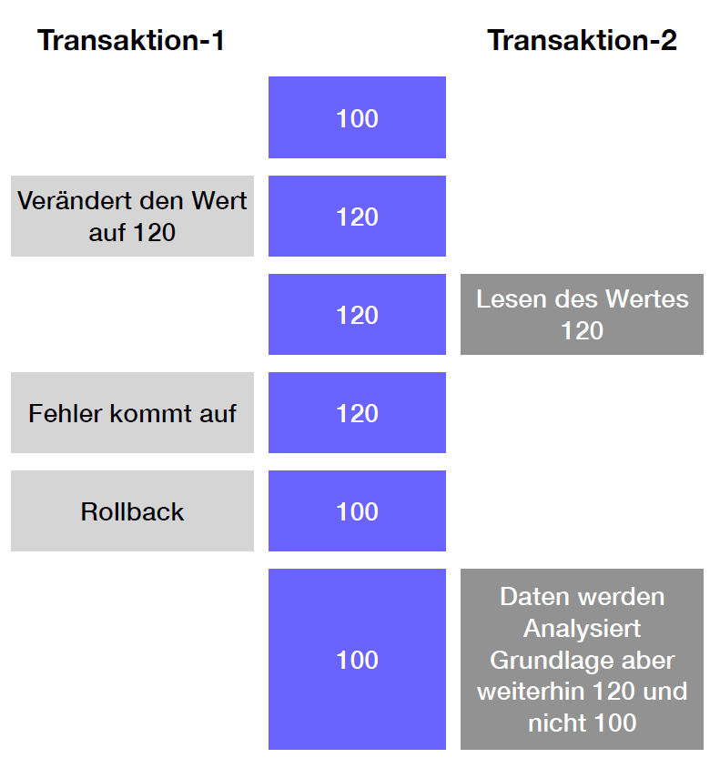
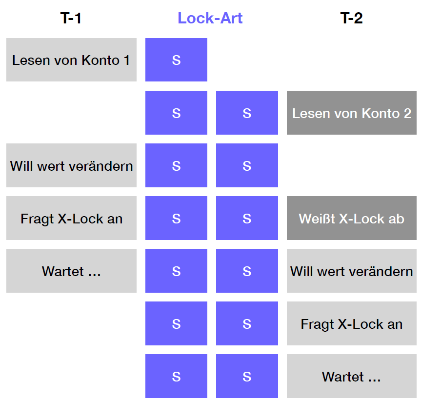
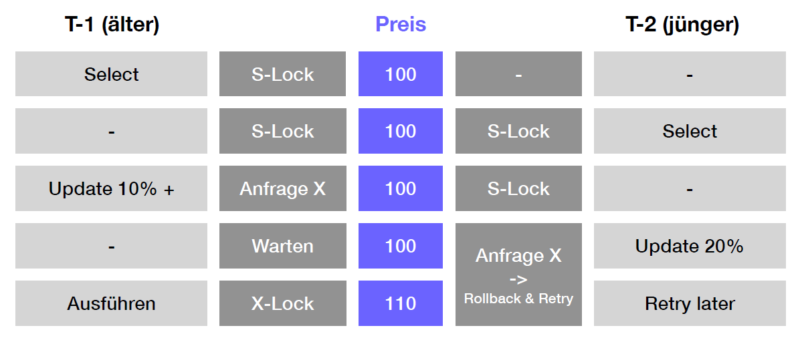
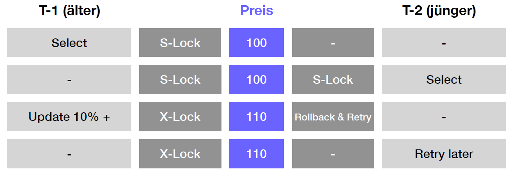

= Concurrency
Mctom Spdo, Peter Klose
1.0.0, {docdate}: INSY
:icons: font
:sectnums:
:toc: left
:stylesheet: ../../css/dark.css

== Logical Unit of Work

Eine Logical Unit of Work is eine gruppe von Transaktionen, die gemeinsam, logisch gesehen, einen Block arbeit darstellen. +
Ein Beispiel hierfür ist bei einer Banktransaktion: Person A überweist Person B 100€.
In der Datenbank passiert nun folgendes:

1. Person A: 100€ werden abgebucht
2. Person B: 100€ werden zum Kontostand hinzugefügt.

Dies ist eine logische Unit of work, da die beiden Transaktionen gemeinsam einen Arbeitsvorgang ausmachen

Das Problem: was würde passieren, wenn nun zwischen Transaktion 1 und 2 die Datenbank abstützt?
Person A hätte nun 100€ weniger, Person B erhält nichts.

== Transaktionen

Transaktionen sollten genau dieses Problem vermeiden.
Beide diese Operationen werden nun in eine Transaktion verpackt.
Erst wenn diese abgeschlossen ist, dann werden die Änderungen gespeichert.
Im Falle eines Absturzes werden nur die fertigen Transaktionen wiederhergestellt.
Alle nicht beendeten Transaktionen werden nicht gespeichert.

Dies führt zu einem **konsistenten** Zustand in der Datenbank.

"Entweder alles oder gar nichts"

=== ACID Eigenschaften einer Transaktion:

1. **[.underline]#A#**tomicity: Alles oder nichts
2. **[.underline]#C#**onsitency: Vor und nach Transaktion in konsistenten Zustand
3. **[.underline]#I#**solation: Nutzer haben den Eindruck, alleine auf der DB zu sein
4. **[.underline]#D#**urability: Nach erfolgreichen Abschluss: Transaktion dauerhaft in DB

== Concurrency & Locking

Es gibt viele Gründe, warum concurrency auf einer Datenbank auftreten.
Meist liegt es aber daran, dass viele Anfragen auf einmal kommen.
Hierbei kann es zu mehreren Problemen kommen:

=== Verlorenes Update

.Prozessvorgang bei verlorenem Update

Bei einem verlorenen Update, wie schon im Titel erkennbar, geht es darum, dass eine Änderung eines Datensatzes verloren geht.

Hierbei gibt es 2 Prozesse, die in unterschiedlicher Reihenfolge einen gewissen Datensatz updaten.
Da dies allerdings parallel ausgeführt werden, kann es passieren, dass das Update des Prozesses 1 nicht in das Update des Prozesses 2 mit einfließt.
Hierdurch geht das Update von Prozess 1 verloren

=== Schreib-Lese-Konflikt (Dirty Read / Write)

==== Dirty Read

.Ablauf Dirty Read

Bei einem Dirty read, wird ein Datensatz ausgelesen, während ein anderer Prozess diesen verändert.
Dadurch kann ein zwischenstatus ausgelesen werden, welcher allerdings nicht hätte gelesen werden sollen.

==== Dirty Write

.Ablauf Dirty Write

Bei einem Dirty write wird ein Datensatz ausgelesen, während ein anderer Prozess diesen verändert, und diesen anschließend (nach dem Auslesen) zurücksetzt.
Das Problem: Der alte noch nicht zurückgesetzte Datensatz wird nun wieder verändert, welches zu inconsistent Daten führen kann.

=== Nicht wiederholbares Lesen (Non-Repeatable Read)

Bei einem nicht wiederholbaren lesen wird ein Datensatz gelesen, welcher durch einen Prozess, der später fehlschlägt, auf den Stand vor dem Starten des Prozesses zurückgesetzt wird. +
Die Folge davon ist, dass mit falschen Daten gearbeitet wird.

=== Phantomproblem (Inconsistent Read)

.Ablauf Phantomproblem
image::images/phantom-problem.png[]

Beim Phantomproblem wird ein gewisser Datensatz gelöscht, während er von einem anderen Statement gerade soeben erst gelesen wurde.
Das führt dazu, dass nicht mehr existierte Daten z.B. in einer Summe inkludiert worden sind.

== Locking

Wenn Prozess A eine Tabelle oder Datensatz benötigt, sperrt dieser diesen.
Somit wird das falsche abändern durch andere Instanzen verhindert.
Es gibt keinen Zugriff auf Objekte der DB, ohne ein Lock zu verwenden.

=== Locking types

Bei Locking gibt es zwei Ansätze:

* **Pessimistisch:** Sperrt alle was gebraucht wird ("for update")
* **Optimistisch:** Es wird schon nichts passieren, nur ein kurzer Vergleich auf Änderungen vor einem Update

=== Exclusive Lock (X-Lock)

Bei dem XLock werden alle Anfragen auf denselben Datensatz blockiert.

=== Shared Lock

Bei einem shared lock werden alle X Lock Anfragen blockiert, S Lock Anfragen allerdings erlaubt

[cols="a,a,a,a"]
|===

|**LOCKING**
|X-Lock
|S-Lock
|Offen

|*X-Lock*
|Verboten
|Verboten
|Erlaubt

|*S-Lock*
|Verboten
|Erlaubt
|Erlaubt

|===

=== Deadlocks

Bei einem Deadlock sperren sich 2 Transaktionen gegenseitig.
Hierbei möchten 2 verschiedene Transaktionen auf dieselben Resources zugreifen.
Dafür wartet eine Transaktion standardmäßig darauf, dass eine Ressource frei wird.
Wenn nun allerdings 2 oder mehr Transaktionen gegenseitig aufeinander warten, dann warten diese unendlich lange.

Dies nennt man einen Deadlock, da beide Transaktionen ewig aufeinander warten, und jeweils eine Resource haben, die sie nicht freigeben, bis die andere bereits belegte Resource frei ist.

=== Sperrtypen

Um Deadlocks zu verhindern, gibt es mehrere Sperrtypen in Oracle:

==== Two Phase Locking

Eine Transaktion sperrt gleich zu Beginn alle benötigten Ressourcen.
Wenn dies allerdings nicht möglich ist, gibt diese alle Ressourcen wieder frei, und wartet ein bisschen, bis der Vorgang von vorne beginnt.
Erst wenn alle benötigten Ressourcen gesperrt sind, darf die Transaktion ausgeführt werden.

Hierbei gibt es mehrere Probleme:

* Alle Objekte sind am Start bekannt (Performance) (manchmal nicht möglich)
* Bei großen Transaktionen werden über lange Zeit viele Datensätze gesperrt
* Unabhängig keine festgelegte Reihenfolge der Transaktion

==== Transactions-Scheduling

Hierbei werden nur die Transaktionen parallel ausgeführt, die nicht auf dieselben Ressourcen zugreifen.

Probleme:

* beschränkt parallele Durchführung (performance)
* Nur unabhängige Transaktionen werden gleichzeitig ausgeführt
* Pessimistisches Locking
* Datenobjekte oft unbekannt -> gesamte Tabelle wird gelockt.

==== Zeitmarkenverfahren

Arbeiten mit Transaktionsstartpunkten.
Abhängig vom alter der Transaktion wird gewartet (wait) oder neu gestartet (restart)

.Beispiel für Zeitmarkenverfahren (Wait-Die)

.Beispiel für Zeitmarkenverfahren (Wound-Wait)

==== Timeout

Das Timeout ist eine sehr gebräuchliche Methode.
Hierbei wird sich der Startzeitpunkt der Transaktion gemerkt.
Wird hierbei die Transaktion in einer gewissen Zeit (konfigurierbar) nicht abgeschlossen, so wird diese zurückgenommen, da ein potenzielles Deadlock entsteht.

=== Setzen von Locks

Locks können auch in Oracle händisch gesetzt werden.
Dazu kann folgender SQL Code verwendet werden:

[source,sql]
----
LOCK TABLE <TABLENAME> in row share mode;
LOCK TABLE <TABLENAME> in share mode;
LOCK TABLE <TABLENAME> in row exclusive mode;
LOCK TABLE <TABLENAME> in share row exclusive mode;
LOCK TABLE <TABLENAME> in exclusive mode;
----

=== Automatisches Locken bei SQL Statements

**SELECT** +
keine Sperre

**INSERT/UPDATE/DELETE** +
write lock / row exclusive

**SELECT FOR UPDATE** +
read lock / row share

**COMMIT / ROLLBACK**
freigeben aller Sperren

